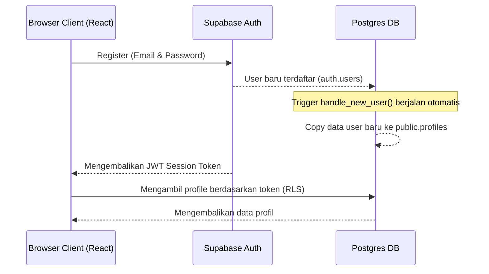

# MIGRATION AUDIT: Supabase to Cloudflare D1 & KV/R2
**Project:** NikahYuk! Digital Invitation App
**Role:** Senior Full-Stack Engineer

Dokumen ini berisi hasil audit teknis mendalam terhadap codebase project untuk mempersiapkan migrasi infrastruktur dari **Supabase (Postgres)** ke **Cloudflare D1 (SQLite)**, **Cloudflare R2 (Storage)**, dan **Cloudflare KV**.

---

## 1. Ringkasan Arsitektur Saat Ini

*   **Frontend Framework:** React 19 + Vite 6 (Single Page Application).
*   **Routing:** `react-router-dom` v7 (Client-side routing menggunakan `BrowserRouter`).
*   **State Management:** `Zustand` (digunakan pada `authStore.ts` untuk mengelola session user).
*   **Database & Backend-as-a-Service:** Supabase.
    *   **Database:** PostgreSQL (15 tabel di skema `public`, relasi foreign key, trigger basis data, dan Row Level Security).
    *   **Autentikasi:** Supabase Auth (Email/Password & OAuth).
    *   **Storage:** Supabase Storage (5 buckets: `music`, `payment-proofs`, `template-thumbnails`, `invitation-media`, dll).
*   **Keamanan Database:** Row Level Security (RLS) di PostgreSQL yang membatasi query langsung dari browser client berdasarkan UID user yang sedang login.

---

## 2. Daftar File yang Perlu Dimodifikasi

Berikut adalah file-file di dalam folder `src/` yang memiliki ketergantungan langsung dengan Supabase client dan memerlukan modifikasi atau penulisan ulang:

### A. Core Library & Services (Pondasi Ketergantungan)
1. [src/lib/supabase.ts](file:///c:/Users/Alif/Downloads/nikahyuk-main/src/lib/supabase.ts) - Inisialisasi client Supabase. *Harus diganti dengan Client API Cloudflare.*
2. [src/services/baseService.ts](file:///c:/Users/Alif/Downloads/nikahyuk-main/src/services/baseService.ts) - Base class CRUD yang menggunakan `supabase`.
3. [src/services/storageService.ts](file:///c:/Users/Alif/Downloads/nikahyuk-main/src/services/storageService.ts) - Logika upload berkas yang terikat langsung dengan Supabase Storage.
4. [src/services/index.ts](file:///c:/Users/Alif/Downloads/nikahyuk-main/src/services/index.ts) - Subclass service undangan, rsvp, guests, dsb. yang melakukan query relasional.

### B. State Stores & Layouts
5. [src/stores/authStore.ts](file:///c:/Users/Alif/Downloads/nikahyuk-main/src/stores/authStore.ts) - Pengelolaan session login, logout, dan sinkronisasi profile.
6. [src/layouts/DashboardLayout.tsx](file:///c:/Users/Alif/Downloads/nikahyuk-main/src/layouts/DashboardLayout.tsx) - Membaca session auth untuk proteksi layout.

### C. Pages (Halaman Utama)
7. [src/pages/Login.tsx](file:///c:/Users/Alif/Downloads/nikahyuk-main/src/pages/Login.tsx) - Form login dengan email & password/Google OAuth.
8. [src/pages/Register.tsx](file:///c:/Users/Alif/Downloads/nikahyuk-main/src/pages/Register.tsx) - Form registrasi user baru.
9. [src/pages/PublicTemplates.tsx](file:///c:/Users/Alif/Downloads/nikahyuk-main/src/pages/PublicTemplates.tsx) - Mengambil daftar template aktif.
10. [src/pages/PublicInvitation.tsx](file:///c:/Users/Alif/Downloads/nikahyuk-main/src/pages/PublicInvitation.tsx) - Halaman undangan publik yang melakukan load query relasional secara simultan (events, wishes, gifts, media, rsvp).

### E. Hooks Dashboard & Fitur Spesifik
11. `src/pages/dashboard/invitation_editor/hooks/useInvitationEditor.ts`
12. `src/pages/dashboard/invitation_editor/index.tsx`
13. `src/pages/dashboard/guests/hooks/useGuests.ts`
14. `src/pages/dashboard/guests/index.tsx`
15. `src/pages/dashboard/rsvp/hooks/useRsvp.ts`
16. `src/pages/dashboard/wishes/hooks/useWishes.ts`
17. `src/pages/dashboard/transactions/hooks/useTransactions.ts`
18. `src/pages/dashboard/transactions/hooks/usePromos.ts`
19. `src/pages/dashboard/transactions/index.tsx`
20. `src/pages/dashboard/templates/hooks/useTemplatesManager.ts`
21. `src/pages/dashboard/templates/hooks/useBgmManager.ts`
22. `src/pages/dashboard/settings/hooks/useSettings.ts`
23. `src/pages/dashboard/overview/hooks/useOverview.ts`
24. `src/pages/dashboard/overview/utils/exportHelper.ts`
25. `src/pages/dashboard/checkin/hooks/useCheckIn.ts`

---

## 3. Analisis Query Supabase di Codebase

### A. Autentikasi (Supabase Auth)
*   `supabase.auth.getSession()`: Mengecek token session saat inisialisasi aplikasi.
*   `supabase.auth.signInWithPassword(...)`: Login tradisional.
*   `supabase.auth.signInWithOAuth(...)`: Login sosial (Google, dsb).
*   `supabase.auth.signUp(...)`: Pendaftaran user baru.
*   `supabase.auth.signOut()`: Logout.
*   `supabase.auth.onAuthStateChange(...)`: Listener perubahan status login.

### B. Query Database (PostgREST)
*   **Select:** `supabase.from(table).select('*, templates:template_id(*)')` -> Memanfaatkan fitur join relation PostgREST Supabase.
*   **Filters:** `.eq()`, `.order()`, `.single()`.
*   **Insert:** `supabase.from(table).insert(payload).select().single()`.
*   **Update:** `supabase.from(table).update(payload).eq('id', id).select().single()`.
*   **Delete:** `supabase.from(table).delete().eq('id', id)`.

### C. File Storage
*   `supabase.storage.from(bucket).upload(path, file, options)`: Mengunggah media.
*   `supabase.storage.from(bucket).getPublicUrl(path)`: Mengambil alamat URL publik berkas.
*   `supabase.storage.from(bucket).remove([path])`: Menghapus berkas yang tidak digunakan.

---

## 4. Struktur Data & Tabel D1 (SQLite)

Semua tabel dari 18 migrasi SQL Supabase dikonversi ke skema SQLite D1. Berikut adalah daftar tabel yang perlu dibuat di D1:

1.  **`profiles`**: Menyimpan data user & informasi paket aktif.
2.  **`templates`**: Menyimpan katalog tema/desain undangan.
3.  **`invitations`**: Informasi utama undangan digital (mempelai, quote, lagu, dsb).
4.  **`events`**: Detail daftar acara pernikahan (akad, resepsi, dll).
5.  **`guests`**: Daftar nama tamu undangan & kode QR unik.
6.  **`rsvps`**: Konfirmasi kehadiran dari para tamu.
7.  **`wishes`**: Buku tamu digital (ucapan & doa dari tamu).
8.  **`gifts`**: Rekening bank / e-wallet untuk amplop digital.
9.  **`media`**: Galeri foto/gambar dokumentasi undangan.
10. **`checkins`**: Pencatatan kehadiran tamu di lokasi acara via QR Code.
11. **`packages`**: Katalog paket harga langganan (Basic, Platinum, dll).
12. **`transactions`**: Transaksi pemesanan dan bukti pembayaran paket undangan.
13. **`promos`**: Pengelolaan kode kupon diskon.
14. **`music_library`**: Perpustakaan berkas audio lagu latar belakang (BGM).
15. **`system_settings`**: Menyimpan data konfigurasi global sistem.

---

## 5. Flow Autentikasi & Session Saat Ini



---

## 6. Environment Variable yang Dibutuhkan

Berikut adalah variabel lingkungan yang harus disiapkan untuk masa migrasi:

### A. Environment Frontend (Vite)
*   `VITE_CLERK_PUBLISHABLE_KEY`: Kunci publik Clerk untuk memproses login/register di sisi client.
*   `VITE_API_BASE_URL`: Base URL API Serverless Cloudflare Workers (jika dideploy terpisah). Jika menggunakan Pages Functions, url backend bisa menggunakan path relatif (`/api`).

### B. Environment Backend (Cloudflare Workers/Pages Settings)
*   `CLERK_SECRET_KEY`: Kunci rahasia untuk memvalidasi JWT token Clerk di level Worker.
*   `DB` (D1 Database Binding): Binding koneksi untuk database D1.
*   `BUCKET` (R2 Bucket Binding): Binding koneksi untuk Cloudflare R2 Storage.
*   `KV` (KV Namespace Binding): Binding koneksi untuk menyimpan slug-mapping dan cache.

---

## 7. Fitur yang Paling Berisiko Saat Migrasi

1.  **Join Queries Relasional (PostgREST):**
    Di client-side, saat ini aplikasi melakukan join seperti `.select('*, templates:template_id(*)')`. SQLite D1 tidak mendukung parsing JSON join secara otomatis seperti PostgREST. Logika join query ini harus ditulis ulang secara aman dengan sintaks SQL JOIN di backend Worker.
2.  **Otomatisasi Berbasis Trigger Basis Data:**
    Trigger Postgres pada database saat ini mengurusi:
    *   Pembuatan data profile otomatis saat registrasi user baru (`handle_new_user`).
    *   Pengaktifan paket & kalkulasi tanggal kedaluwarsa saat transaksi disetujui (`handle_transaction_approval`).
    *   Perlindungan hak akses kolom role agar tidak dapat diubah oleh customer (`protect_profile_role`).
    
    *Semua otomatisasi ini harus dipindahkan ke dalam kode program backend (Cloudflare Workers API) demi keamanan dan kemudahan maintenance.*
3.  **Upload File Langsung dari Client:**
    Supabase Storage mengizinkan upload langsung dari browser berkat kebijakan bucket policy. Pada Cloudflare R2, praktik terbaik adalah mengunggah file melalui API Worker (menggunakan Presigned URL atau mengirim file via POST multi-part ke Worker API yang kemudian menulis ke R2 menggunakan binding).
4.  **Autentikasi Pengguna:**
    Mengganti seluruh state management `supabase.auth` dengan Auth Provider baru seperti Clerk tanpa merusak alur proteksi rute di `ProtectedRoute.tsx`.

---

## 8. Fitur Supabase yang Tidak Bisa Digantikan Langsung oleh D1

| Fitur Supabase | Ekivalen di Cloudflare D1 / Ekosistem | Solusi & Catatan Migrasi |
| :--- | :--- | :--- |
| **Built-in Auth** | Tidak ada | Gunakan **Clerk** atau **Kinde**. Sangat andal dan memiliki free-tier besar. |
| **Row Level Security (RLS)** | Tidak ada | Validasi hak kepemilikan data dipindahkan ke layer kode backend API Worker. |
| **Database Triggers (PL/pgSQL)** | SQLite Trigger (terbatas) | Lebih baik diimplementasikan pada kode backend JS/TS Worker sebelum D1 di-update. |
| **Storage (Object Storage)** | **Cloudflare R2** (S3-compatible) | 10 GB free tier. Gunakan R2 Binding di API Worker untuk operasi CRUD media. |
| **Realtime subscriptions** | Cloudflare Workers WebSocket / Durable Objects | Jika realtime tidak kritis, gunakan short polling biasa pada frontend. |
| **Auto-pause DB** | Tidak ada | Keunggulan D1: database tidak akan di-pause meskipun tidak diakses berhari-hari. |

---

## 9. Rencana Migrasi Bertahap (Phased Migration Plan)

```
+-----------------------------------+
| Tahap 1: Setup D1 & R2 & KV       |
+-----------------------------------+
                  |
                  v
+-----------------------------------+
| Tahap 2: Buat API Worker Backend  |
+-----------------------------------+
                  |
                  v
+-----------------------------------+
| Tahap 3: Integrasikan Clerk Auth   |
+-----------------------------------+
                  |
                  v
+-----------------------------------+
| Tahap 4: Hubungkan Frontend ke API |
+-----------------------------------+
                  |
                  v
+-----------------------------------+
| Tahap 5: Ekspor/Impor Data & Live |
+-----------------------------------+
```

### Tahap 1: Inisialisasi Database D1 & R2
1. Jalankan inisialisasi skema SQLite menggunakan file `d1_schema.sql` ke database lokal & remote D1.
2. Buat bucket Cloudflare R2 untuk menampung gambar dan musik.

### Tahap 2: Pembuatan API Worker (Backend Layer)
1. Buat Cloudflare Worker (atau Pages Functions) di folder `/functions`.
2. Tulis endpoint API dasar untuk menerima query CRUD dari frontend secara aman menggunakan D1 query builder atau raw SQL.
3. Gunakan Cloudflare KV untuk memetakan `slug` undangan ke `invitation_id` untuk mempercepat waktu akses tamu dan menghemat kuota D1 read.

### Tahap 3: Implementasi Autentikasi Clerk
1. Integrasikan SDK Clerk di frontend.
2. Ganti logika Login & Register di frontend.
3. Buat webhook Clerk di Worker untuk menyalin data user baru ke tabel `profiles` di D1 saat pendaftaran selesai.

### Tahap 4: Pengalihan Service Frontend (Refactoring)
1. Ubah file `src/services/` agar menggunakan endpoint API `/api/` baru alih-alih memanggil `supabase` client.
2. Pastikan file-file yang sebelumnya memanggil `supabase` langsung di-refactor menggunakan fetch client.

### Tahap 5: Migrasi Data & Deploy
1. Ekspor data dari Supabase (jika ada) ke bentuk file CSV.
2. Jalankan skrip import data CSV ke database D1.
3. Lakukan deployment penuh ke Cloudflare Pages.

---

## 10. Rekomendasi Strategi: Full vs. Hybrid

**Rekomendasi:** **Full Migration (Migrasi Penuh)**

**Alasan:**
1. **Free Tier Maksimal:** Manfaat bebas biaya egress pada R2 dan database D1 yang aktif selamanya hanya tercapai optimal jika seluruh aset dipindahkan secara total.
2. **Kompleksitas Sinkronisasi:** Jika memilih model Hybrid (misal: Auth di Supabase, data di D1), kita harus mengelola dua token autentikasi berbeda dan menjaga sinkronisasi data antar dua server cloud yang akan meningkatkan latensi dan kompleksitas bug.
3. **Penyederhanaan Layanan:** Aplikasi ini adalah undangan pernikahan digital yang sebagian besar layanannya adalah query CRUD sederhana (membaca undangan, mengisi RSVP, mengirim ucapan). Memindahkan seluruh data ke SQLite D1 dengan optimasi caching di KV adalah pilihan terbaik dari sudut pandang performa, biaya operasional, dan kepraktisan.
